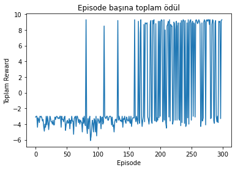
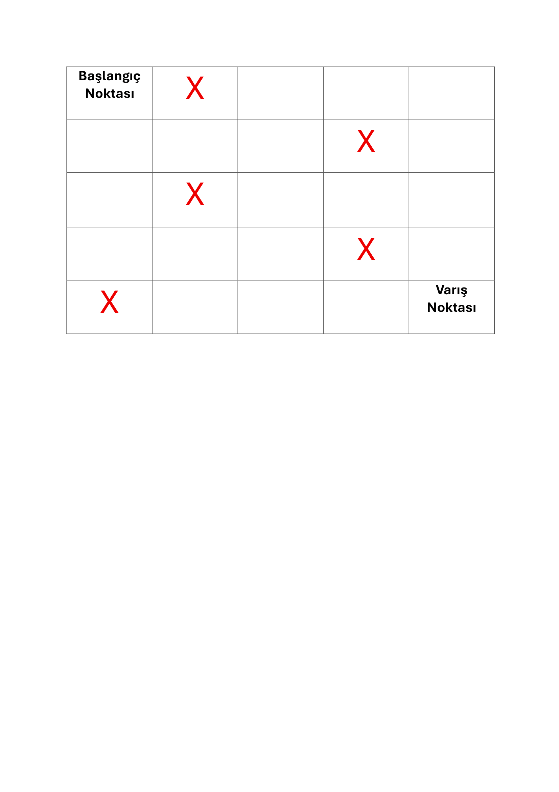

# 🤖 Autonomous Robot Navigation with Q-Learning

This project demonstrates a Reinforcement Learning (RL) implementation where a Q-Learning agent learns to navigate a 5x5 GridWorld environment while avoiding obstacles and reaching a goal state.

The agent starts with full exploration and gradually learns the optimal path using Bellman Equation-based Q-table updates.

---

## 📌 Environment Overview

- **Grid Size:** 5x5 (25 states)
- **Action Space:** 4 actions (Up, Down, Left, Right)
- **Start State:** (0, 0)
- **Goal State:** (4, 4)
- **Obstacles:** (0,1), (1,3), (3,1), (3,3), (4,1)

---

## 🏆 Reward Mechanism

| Event | Reward |
|--------|--------|
| Reaching Goal | +10 |
| Hitting Obstacle | -3 |
| Standard Move | -0.1 |

A small step penalty encourages the agent to find shorter paths.

---

## 🧠 Q-Learning Configuration

- **Learning Rate (α):** 0.1  
- **Discount Factor (γ):** 0.99  
- **Initial Epsilon:** 1.0  
- **Epsilon Decay:** 0.995  
- **Minimum Epsilon:** 0.1  

Exploration vs Exploitation is handled using an epsilon-greedy strategy with decay.

---

## 🧮 Q-Update Rule

The Q-table is updated using the Bellman Equation:

$$Q(s,a) \leftarrow Q(s,a) + \alpha [r + \gamma \max_{a'} Q(s',a') - Q(s,a)]$$

Where:

- \(s\): current state  
- \(a\): selected action  
- \(r\): reward received  
- \(s'\): next state  
- \(\alpha\): learning rate  
- \(γ\): discount factor  

---

## 📈 Learning Performance

As training progresses, the agent transitions from random exploration to optimized path selection.

Below is the learning curve showing total reward per episode:



---
## Environment

Below is the 5x5 grid environment used in training:



---


## 🛠 Tech Stack

- Python
- NumPy
- Matplotlib

---

## ▶️ Run the Project

Clone the repository:

```bash
git clone https://github.com/ferhattkoc-ml/robot-kesif-qlearning.git
cd robot-kesif-qlearning
python robot_kesif.py
