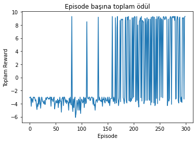
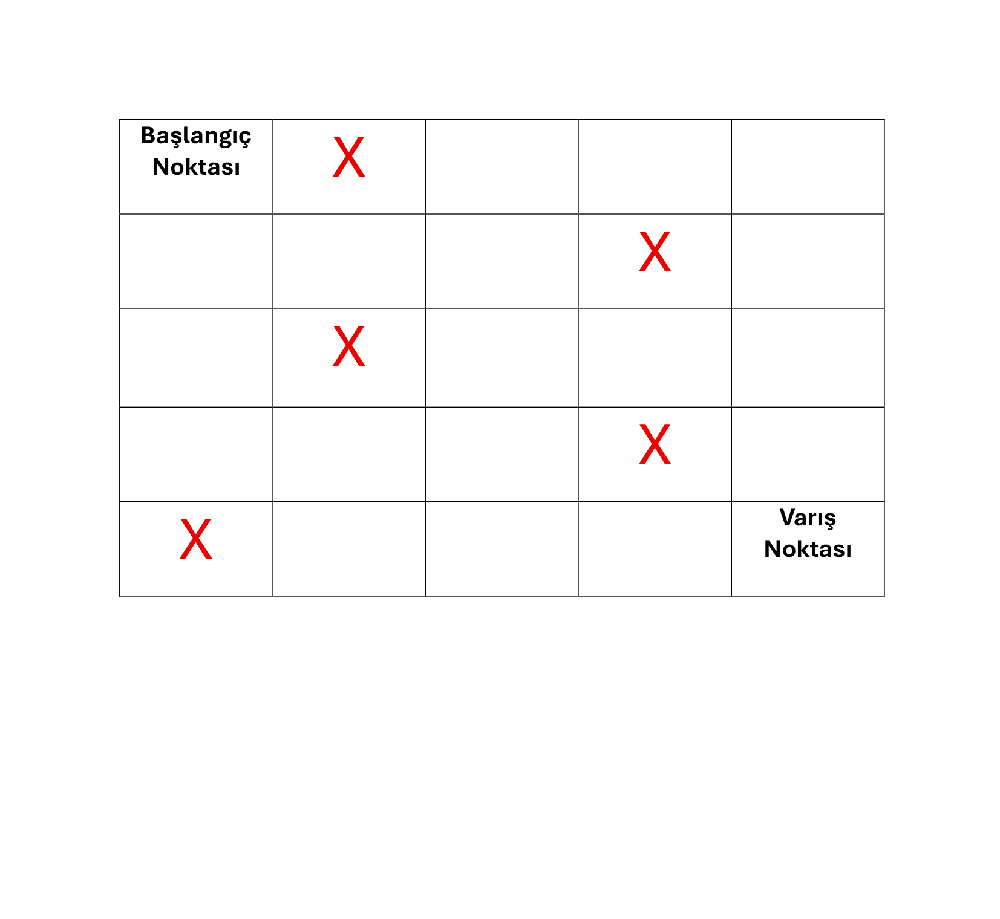

# 🤖 Autonomous Robot Navigation with Q-Learning

This project demonstrates a Reinforcement Learning (RL) implementation where a Q-Learning agent learns to navigate a 5x5 GridWorld environment while avoiding obstacles and reaching a target state. 

The agent starts with full exploration and gradually learns the optimal path using Bellman Equation-based Q-table updates.

## 📌 Environment Overview

*   **Grid Size:** 5x5 (25 states)
*   **Action Space:** 4 actions (Up, Down, Left, Right)
*   **Start State:** `(0, 0)`
*   **Goal State:** `(4, 4)`
*   **Obstacles:** `(0,1), (1,3), (3,1), (3,3), (4,1)`

## 🏆 Reward Mechanism

A small step penalty encourages the agent to find the shortest possible path.

| Event | Reward |
| :--- | :--- |
| **Reaching Goal** | `+10` |
| **Hitting Obstacle** | `-3` |
| **Standard Move** | `-0.1` |

## 🧠 Q-Learning Configuration

Exploration vs Exploitation is handled using an $\epsilon$-greedy strategy with decay.

*   **Learning Rate ($\alpha$):** 0.1
*   **Discount Factor ($\gamma$):** 0.99
*   **Initial Epsilon ($\epsilon$):** 1.0
*   **Epsilon Decay:** 0.995
*   **Minimum Epsilon:** 0.1

## 🧮 Q-Update Rule

The Q-table is updated using the Bellman Equation:

$$Q(s, a) \leftarrow Q(s, a) + \alpha \left[ r + \gamma \max_{a'} Q(s', a') - Q(s, a) \right]$$

**Where:**
*   $s$: current state
*   $a$: selected action
*   $r$: reward received
*   $s'$: next state
*   $\alpha$: learning rate
*   $\gamma$: discount factor

## 📈 Learning Performance & Environment

As training progresses, the agent transitions from random exploration to optimized path selection.

*(Note for Ferhat: Add your learning curve and environment grid images below by replacing the links)*

**Total Reward per Episode:**


**5x5 Grid Environment:**


## 🛠 Tech Stack

*   Python
*   NumPy
*   Matplotlib

## ▶️ Run the Project

Clone the repository and run the script:

```bash
git clone [https://github.com/ferhattkoc-ml/robot-kesif-qlearning.git](https://github.com/ferhattkoc-ml/robot-kesif-qlearning.git)
cd robot-kesif-qlearning
python robot_kesif.py


